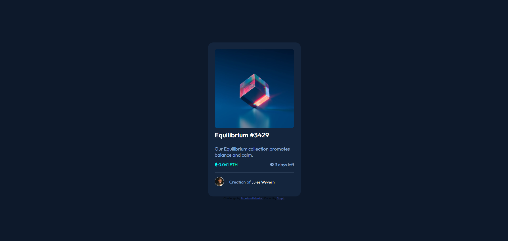

# Steph - NFT preview card component solution

This is a solution to the [NFT preview card component challenge on Frontend Mentor](https://www.frontendmentor.io/challenges/nft-preview-card-component-SbdUL_w0U). 

## Overview

### Screenshot

You can check it out live [here](https://xstephx.github.io/nft-preview-card-component-challenge/).

## My process

### Built with

- Semantic HTML5 markup
- CSS custom properties
- CSS Variables
- CSS Flexbox
- CSS Media Queries

# 🚀🚀🚀

